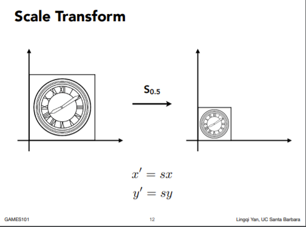
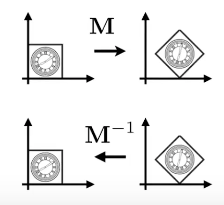
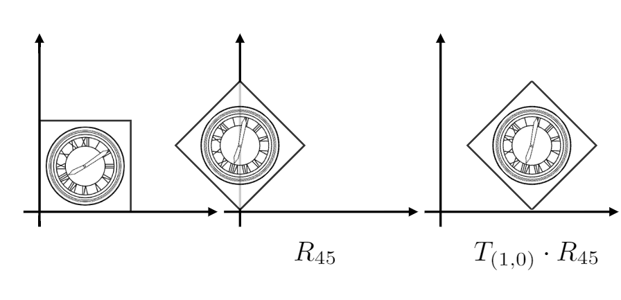
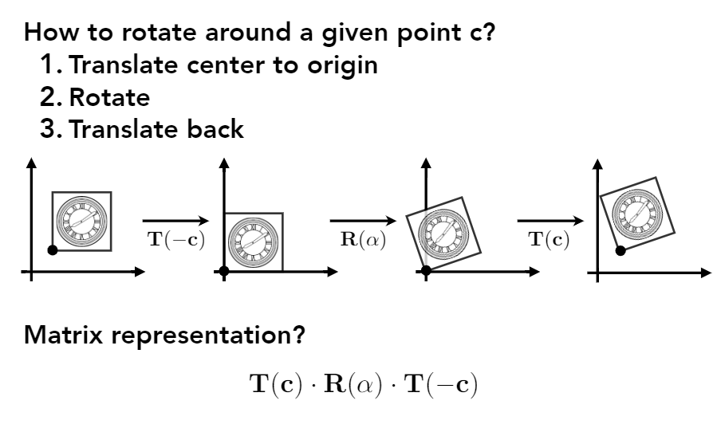

<!--
 * @Autor: Guo Kainan
 * @Date: 2021-08-27 11:20:28
 * @LastEditors: Guo Kainan
 * @LastEditTime: 2021-08-29 08:09:25
 * @Description: 
-->
# 简单的二维变换

## 缩放变换(Scale)

例：若把一个物体在x、y方向分别放大 $s_x$ 、 $s_y$ 倍，相对于图像的每一个点都乘上一个缩放矩阵，变化成新的点。
$$ \begin{pmatrix} s_x & 0 \\ 0 & s_y \end{pmatrix} \begin{pmatrix} x \\ y \end{pmatrix} = \begin{pmatrix} s_xx \\ s_yy \end{pmatrix} $$
故二维缩放矩阵为：
$$ \begin{pmatrix} s_x & 0 \\ 0 & s_y \end{pmatrix} $$

## 对称变换(Reflection)
例：把一个物体相对于y轴(x轴)进行对称翻转，相对于图像所有点的x坐标(y坐标)变号。

由此得关于y轴的对称矩阵为：
$$ \begin{pmatrix} -1 & 0 \\ 0 & 1 \end{pmatrix} $$
$$ \begin{pmatrix} -1 & 0 \\ 0 & 1 \end{pmatrix} \begin{pmatrix} x \\ y \end{pmatrix} = \begin{pmatrix} -x \\ y \end{pmatrix} $$
关于x轴的对称矩阵为：
$$ \begin{pmatrix} 1 & 0 \\ 0 & -1 \end{pmatrix} $$
$$ \begin{pmatrix} 1 & 0 \\ 0 & -1 \end{pmatrix} \begin{pmatrix} x \\ y \end{pmatrix} = \begin{pmatrix} x \\ -y \end{pmatrix} $$

## 切变(Shear)
例：把一个物体朝某x正方向拉伸

$$ \begin{pmatrix} 1 & a \\ 0 & -1 \end{pmatrix} $$

## 旋转(Rotation)
例：把一个物体，以原点为旋转中心进行旋转 $\theta$ 角度。

旋转矩阵为：
$$ \begin{pmatrix} \cos \theta & -\sin \theta \\ \sin \theta & \cos \theta \end{pmatrix} $$

## 平移(Translation)
例：把一个物体在x、y方向分别移动 $t_x$ 、 $t_y$

易知，平移变化为加法：
$$ \begin{pmatrix} x \\ y \end{pmatrix} + \begin{pmatrix} t_x \\ t_y \end{pmatrix} = \begin{pmatrix} x + t_x \\ y + t_y \end{pmatrix} $$

## 线性变换问题
我们注意到，平移时是做矩阵的加法，并不像其他变换一样是通过乘法实现的线性变换。

能否有一种方式，将平移变化与其他形式的变化统一起来，用线性变换表示呢？

通过引入**齐次坐标(Homogenous Coordinates)** 解决问题。

# 齐次坐标(Homogenous Coordinates)
给二维坐标增加一个维度，这样就可以把所有变换统一以矩阵乘法表示所有的线性变换。

在新的规则下，二维的点表示为 $(x, y, 1)^T$ ，二维的向量表示为 $(x, y, 0)^T$ 。

于是，平移变化表示为：
$$ \begin{pmatrix} 1&0&t_x \\ 0&1&t_y \\ 0&0&1 \end{pmatrix} \begin{pmatrix} x \\ y \\ 1 \end{pmatrix} = \begin{pmatrix} x + t_x \\ y + t_y \\ 1 \end{pmatrix} $$

## 其次坐标下的点和向量
在其次坐标的扩充下，二维的点表示为 $(x, y, 1)^T$ ，二维的向量表示为 $(x, y, 0)^T$ 。

为什么向量的齐次坐标扩充为0呢？因为向量具有平移不变性，扩充为0可以确保平移不变：
$$ \begin{pmatrix} 1&0&t_x \\ 0&1&t_y \\ 0&0&1 \end{pmatrix} \begin{pmatrix} x \\ y \\ 0 \end{pmatrix} = \begin{pmatrix} x \\ y \\ 0 \end{pmatrix} $$

此外，与点的齐次坐标扩充为1相结合，正好满足以下性质：
- 向量 + 向量 = 向量
- 点 - 点 = 向量
- 点 + 向量 = 点

## 点 + 点 有什么意义？
按照上文的性质，那么 点 + 点 有何意义呢？
$$ \begin{pmatrix} x_a \\ y_a \\ 1 \end{pmatrix} + \begin{pmatrix} x_b \\ y_b \\ 1 \end{pmatrix} = \begin{pmatrix} x_a + x_b \\ y_a + y_b \\ 2 \end{pmatrix} $$

这里引出一个计算机图形学的**规定**：

在其次坐标下，对于二维坐标点 $(x, y, w)^T$ ，若 $w \ne 0$ ，则点实际为 $(x/w, y/w, 1)^T$ 。

因此，上面的  点 + 点 的结果其实是两点之间的中点。
$$ \begin{pmatrix} x_a + x_b \\ y_a + y_b \\ 2 \end{pmatrix} = \begin{pmatrix} \frac {x_a + x_b}{2} \\ \frac {y_a + y_b}{2} \\ 1 \end{pmatrix} $$

# 仿射变换(Affine Transformations)
把引入齐次坐标后的线性变换称为仿射变换，二维仿射变换定义如下：
$$ \begin{pmatrix} x' \\ y' \\ 0 \end{pmatrix} = \begin{pmatrix} a&b&t_x \\ c&d&t_y \\ 0&0&1 \end{pmatrix} \begin{pmatrix} x \\ y \\ 1 \end{pmatrix} $$

整个过程相当于**先进行线性变换，再进行平移**。

## 常见的仿射变换矩阵
- 缩放
$$ S(s_x, s_y) = \begin{pmatrix} s_x&0&0 \\ 0&s_y&0 \\ 0&0&1 \end{pmatrix} $$
- 旋转
$$ R(\theta) = \begin{pmatrix} \cos \theta & -\sin \theta & 0 \\ \sin \theta & \cos \theta & 0 \\ 0&0&1 \end{pmatrix} $$ 
- 平移
$$ T(t_x, t_y) = \begin{pmatrix} 1&0&t_x \\ 0&1&t_y \\ 0&0&1 \end{pmatrix} $$

## 逆变换

逆变换在线性代数上，正好对应了原变换矩阵 $M$ 的逆矩阵 $M^{-1}$

## 组合变换
一个图像经过的一系列复杂变换，可以分解为一系列简单变换。

举例如下，设点 $a = (x, y, 1)^T$：
1. 图像先旋转45度，变换矩阵为 $R(45°)$ ，点变换为 $ R(45°)a $ 。
2. 之后再x方向平移1，变换矩阵为 $T(1, 0)$ ，点变换为 $ T(1, 0) \cdot R(45°)a $ 。

每执行一个变换，就相当于在前面乘上一个对应的变换矩阵。那么一系列复杂变换的矩阵就可以由多个简单变换矩阵的乘积得出。

需要注意的是，变换的顺序非常重要，**顺序不同，结果不同**，因为矩阵乘法不满足交换律。

在上面的例子中，整体的变换矩阵为：
$$ M = T(1, 0) \cdot R(45°) $$

推广到普遍情况，若先后进行一系列变换 $A_1, A_2, A_3, \ldots, A_n $ ，整体的变换矩阵为：
$$ M = A_nA_{n-1} \ldots A_3A_2A_1 $$

## 组合变换的应用
一个矩形如何绕自身的左下角进行旋转呢？应用上一节的组合变换就可以解决，图示如下：

