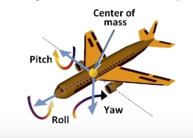

<!--
 * @Autor: Guo Kainan
 * @Date: 2021-08-28 11:01:15
 * @LastEditors: Guo Kainan
 * @LastEditTime: 2021-08-29 08:38:36
 * @Description: 
-->
# 三维变换
三维点： $(x, y, z, 1)^T$

其次坐标不为1的点： $(x, y, z, w)^T = (x/w, y/w, z/w, 1)^T(w \ne 0)$

三维向量： $(x, y, z, 0)^T$

三维仿射变换：
$$ \begin{pmatrix} x' \\ y' \\ z' \\ 0 \end{pmatrix} = \begin{pmatrix} a&b&c&t_x \\ d&e&f&t_y \\ g&h&i&t_z \\ 0&0&0&1 \end{pmatrix} \begin{pmatrix} x \\ y \\ z \\ 1 \end{pmatrix} $$

# 常用的三维变换
- 缩放
$$S(s_x, s_y, s_z) = $$

- 平移
$$T(t_x, t_y, t_z) = $$

- 旋转
  - 绕x轴
  $$ R_x(\theta) = \begin{pmatrix} 1&0&0&0 \\ 0&\cos \theta&-\sin \theta&0 \\ 0&\sin \theta&\cos \theta&0 \\ 0&0&0&1 \end{pmatrix} $$
  - 绕y轴
  $$ R_y(\theta) = \begin{pmatrix} \cos \theta&0&\sin \theta&0 \\ d&e&f&t_y \\ g&h&i&t_z \\ 0&0&0&1 \end{pmatrix} $$
  - 绕z轴
  $$ R_z(\theta) = \begin{pmatrix} a&b&c&t_x \\ d&e&f&t_y \\ g&h&i&t_z \\ 0&0&0&1 \end{pmatrix} $$
  - 一般性的旋转

    

    物体常用旋转
    - 滚转，Roll，沿z轴(内外)方向旋转，侧偏。
    - 俯仰，Pitch，沿x轴(水平)方向旋转，抬头低头。
    - 偏航，Yaw，沿y轴(数值)方向旋转，改变头的水平朝向。

    可以用上述三种简单旋转的组合，得到通用的旋转。

## 罗德里格斯旋转公式(Rodrigues' Rotation Formula)

定义了通用旋转的公式。

假设旋转角度为 $\theta$ ，一个过原点的旋转轴为 $n$ ，则公式为：

如果我们想把过原点的旋转轴推广为任意轴，该如何做呢？

运用上一课的**变换组合**：先把图像平移到原点，再旋转，再平移回来。

