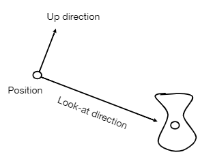
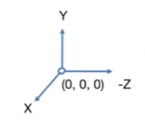
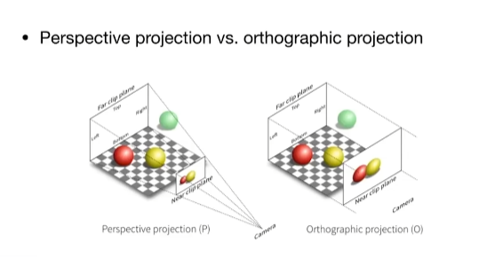
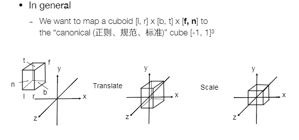

<!--
 * @Autor: Guo Kainan
 * @Date: 2021-08-29 08:41:37
 * @LastEditors: Guo Kainan
 * @LastEditTime: 2021-08-29 11:23:13
 * @Description: 
-->
# 观测变换 Viewing transformation
- 视图/相机变换 View / Camera transformation
- 投影变换 Projection transformation
  - 正交投影 Orthographic projection
  - 透视投影 Perspective projection

## 如何进行观测
- 模型(Model)：找一个地方，取景。
- 视图(View)：找一个拍照角度。
- 投影(Projection): 拍照。

# 视图变换 View / Camera transformation
## 视图：如何摆放照相机

- Position 相机的坐标点： $e$
- Look-at / gaze direction 相机的朝向： $\hat g$
- Up direction 相机的向上方向，定义俯仰： $\hat t$
- 按照常理，相机的向上方向与朝向垂直，即 $\hat g \bot \hat t$

## 视图变换的基本研究方法
相机和所有的物体相对位置保持不变时，拍出来的照片不变。

因此为了方便研究，我们定义相机永远在以下的固定位置：
- 坐标系为右手系。
- 相机放在原点 $(0, 0, 0, 1)^T$ 。
- 相机往 $-z$ 轴方向看。
- 相机的上方向为 $y$ 轴。

## 特殊情况转换为基本情况
那么对于任意位置的相机，如何转化为基本情况进行研究呢？操作如下：
- 先把相机的位置 $e = (x_e, y_e, z_e)^T$ 平移到原点
$$ T_{view} = \begin{pmatrix} 1&0&0&-x_e \\ 0&1&0&-y_e \\ 0&0&1&-z_e \\ 0&0&0&1 \end{pmatrix} $$

- 到达原点后，进行旋转，使朝向 $\hat g$ 与 $-z$ 重合，向上方向 $\hat t$ 与 $y$ 重合， $\hat g × \hat t$ 与 $x$ 重合。

  直接推导旋转矩阵比较困难，但是求逆变换较容易，逆变换如下： 
  - $\hat x = (1, 0, 0, 0)^T$ 旋转到 $\hat g × \hat t = (x_{\hat g × \hat t}, y_{\hat g × \hat t}, z_{\hat g × \hat t}, 0)^T$
  - $\hat y = (0, 1, 0, 0)^T$ 旋转到 $\hat t = (x_{\hat t}, y_{\hat t}, z_{\hat t}, 0)^T$
  - $\hat z = (0, 0, 1, 0)^T$ 旋转到 $-\hat g = (-x_{\hat g}, -y_{\hat g}, -z_{\hat g}, 0)^T$

  易知逆变换的旋转矩阵为：
  $$R_{view}^{-1} = \begin{pmatrix} x_{\hat g × \hat t} & x_{\hat t} & -x_{\hat g} & 0 \\ y_{\hat g × \hat t} & y_{\hat t} & -y_{\hat g} & 0 \\ z_{\hat g × \hat t} & z_{\hat t} & -z_{\hat g} & 0 \\ 0&0&0&1 \end{pmatrix}$$

  我们注意到，无论是 $x$ 、 $y$ 、 $z$ 轴，还是相机的 $\hat g$ 、 $\hat t$ 、 $\hat g × \hat t$ ，都是两两正交的单位向量，按照**正交矩阵**的定义，这样的向量组成的矩阵为正交矩阵，正交矩阵具有以下性质： $A^TA = AA^T = E$

  再结合矩阵的逆的性质： $AA^{-1} = A^{-1}A = E$

  可以知道对于正交矩阵： $A^T = A^{-1}$

  因此旋转矩阵可以如此求得： $ R_{view} = (R_{view}^{-1})^T $

  故：
  $$R_{view} = \begin{pmatrix} x_{\hat g × \hat t} & y_{\hat g × \hat t} & z_{\hat g × \hat t} & 0 \\ x_{\hat t} & y_{\hat t} & z_{\hat t} & 0 \\ -x_{\hat g} & -y_{\hat g} & -z_{\hat g} & 0 \\ 0&0&0&1 \end{pmatrix}$$

那么，相机从特殊情况转为基本情况的变换矩阵，即为两个变换矩阵的乘积：
$$M_{view} = R_{view}T_{view} = \begin{pmatrix} x_{\hat g × \hat t} & y_{\hat g × \hat t} & z_{\hat g × \hat t} & 0 \\ x_{\hat t} & y_{\hat t} & z_{\hat t} & 0 \\ -x_{\hat g} & -y_{\hat g} & -z_{\hat g} & 0 \\ 0&0&0&1 \end{pmatrix} \begin{pmatrix} 1&0&0&-x_e \\ 0&1&0&-y_e \\ 0&0&1&-z_e \\ 0&0&0&1 \end{pmatrix}$$

这个矩阵即为**视图/相机变换矩阵**

除了要移动相机，为了要保证其他物体与相机的相对不变性，所以其他物体也要应用通用的变换，乘上这个矩阵。

# 投影变换 Projection transformation
## 正交投影和透视投影

- 正交投影常用于工程制图，并没有出现“近大远小”的透视现象。
- 透视投影会出现“近大远小”的效果，更接近人眼成像。

## 正交投影 Orthographic projection

正交投影的操作步骤如下：
- 定义一个空间中的立方体，能够正好把图像包括起来，这个立方体如此定义：
  - $x$ 轴方向上定义 左$l$ 和 右$r$，$r > x$
  - $y$ 轴方向上定义 上$t$ 和 下$b$，$t > b$
  - $-z$ 轴方向上定义 远$f$ 和 近$n$，$f < n$

- 将立方体中心移动到原点，得到平移矩阵：
$$T_{ortho} = \begin{pmatrix} 1&0&0& -\frac {r + l}{2} \\ 0&1&0& -\frac {t + b}{2} \\ 0&0&1& -\frac {n + f}{2} \\ 0&0&0&1 \end{pmatrix} $$

- 缩放为单位立方体 $[-1, 1]^3$ 范围内，得到缩放矩阵：
$$S_{ortho} = \begin{pmatrix} \frac {2}{r - l} &0&0&0 \\ 0& \frac {2}{t - b} &0&0 \\ 0&0& \frac {2}{n - f} &0 \\ 0&0&0&1 \end{pmatrix}$$

- 将平移以及缩放变换组合，得到正交投影矩阵：
$$M_{ortho} = S_{ortho}T_{ortho} = \begin{pmatrix} \frac {2}{r - l} &0&0&0 \\ 0& \frac {2}{t - b} &0&0 \\ 0&0& \frac {2}{n - f} &0 \\ 0&0&0&1 \end{pmatrix} \begin{pmatrix} 1&0&0& -\frac {r + l}{2} \\ 0&1&0& -\frac {t + b}{2} \\ 0&0&1& -\frac {n + f}{2} \\ 0&0&0&1 \end{pmatrix}$$

## 透视投影 Perspective projection
- 在图形学、艺术、视觉方面有最广泛的应用。
- 具有“近大远小”的视觉效果。
- 视觉效果中，平行线不再平行，而是相交于一点。

具体操作步骤如下：
- 

